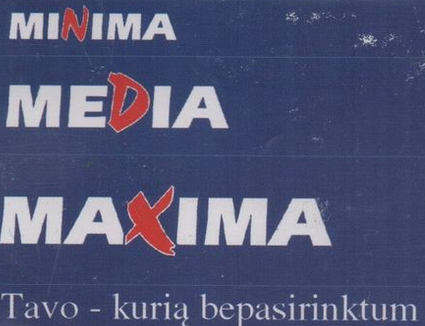

## Minima Media Maxima

 

#### Let's travel back in time, to 2000s Lithuania, and go shopping!

There are three shops: Minima, Media and Maxima.
 
Each of the shops has a variety of items you can buy. Each of them is bigger than
the other, respectively, as the names suggest.
 
 
To start this exercise, you will need to read a file: `items.csv`
 
Open this file and inspect its contents. You will see columns:
`ID, item, price, quantity, shop and category`
 

#### The Stock
1. Read the file and parse the csv items to Item objects
2. Put all Item objects to their respective Shop objects
3. Each Shop object has to have a method to give a discount for Items by category,
e.g. 20% discount to hygiene items
4. Each Shop has to have a method to sort Items by their price
5. EXTRA: sort by price in a category

Now that we've read the file and have our shops ready and open,
let's introduce a customer!

#### The Customer
1. Our Customer has an ID, name and surname, and age
2. The customer needs to have a Wallet object. In this Wallet, he has some cash and
a credit card
3. The customer has an inventory to put his Items in

#### The Shopping
1. Inside the main.js file, instantiate all Shops 
2. Create three Customers:
* First customer: age 22, €20 in cash and €15.5 in card balance
* Second customer: age 16, €10 in cash €25.3 in card balance
* Third customer: age 30, €1.2 in cash (broke)
3. The first customer wants to buy 1 Gourmet Cheese, 2 Water Bottles, Shampoo, Organic Tea and Bread.
4. The second customer is cheeky - she's only 16, but wants to buy some Wine,
a Pizza, some Soap and some Face Cream
5. The third customer only wants to buy 1 Bread and 1 Water Bottle

Remember, we travelled to the past, there weren't any Euros at that time in Lithuania, so we will have to find an Exchange to convert our money to Litas

#### The Exchange
1. Create a Bank object that does a simple thing: converts the currencies at a rate of
1:3.45
2. Once the Bank is instantiated, it can be used to convert each balance for a fee of 3Lt. Cash and card exchanges are paid for separately.

#### Rules
* Minima doesn't accept card, so only payments in cash are available there 
* Alcohol can only be sold to over 18s
* If the shop is out of stock for an item, it cannot be sold
* If a Customer doesn't have enough money to pay for a conversion, the conversion
cannot be performed
* If a Customer doesn't have enough money for an item, he cannot buy it

---
All of our customers try to buy their stuff. Some are more successful than others.
The third customer cannot buy his water, so he waits for a couple hours and Minima
announces a discount - 50% on drinks. The homeless guy from the future then
tries again and is successful!

#### Tips
* You have the freedom to write as many helper methods as you want inside the
Objects - treat this exercise in a problem solving manner.
If you need a method - write it
* Don't forget OOP principles: if a Shop or a Customer or a Wallet needs to
do something - the doing should be done in these objects
* Try to find a simple way, that does not require many outside dependencies, to read
and parse the CSV file
* Do the parsing, have a list of objects that you can work with first (read the file
once and be done with it) and work with those parsed objects later
* Throw Errors, guard your clauses early, to avoid unexpected behavior later
---
Have fun!

